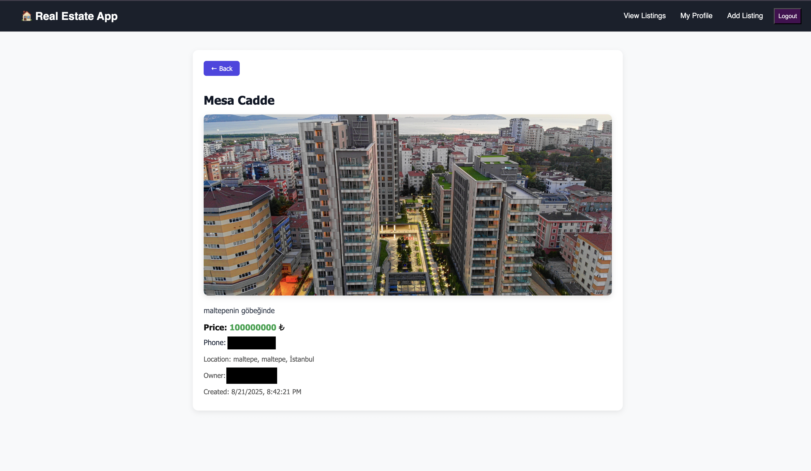
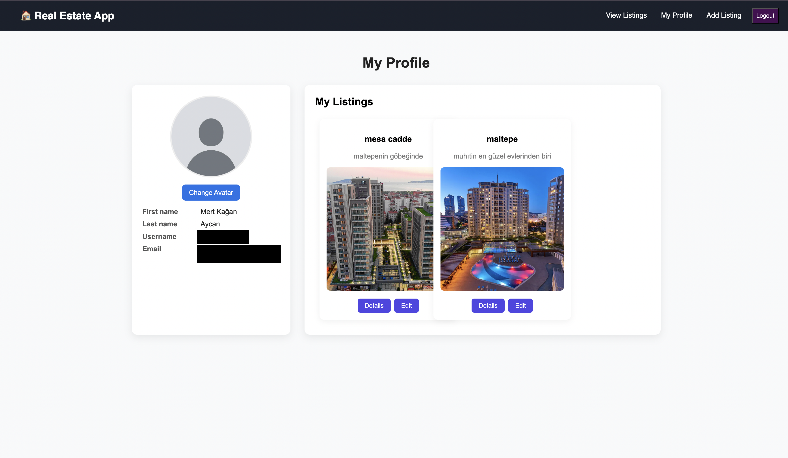

# 🏡 Real Estate Web App

A **full-stack real estate application** built with **React**, **Node.js**, and **MongoDB**, featuring **JWT authentication**, **property listings**, **image uploads**, and a **responsive UI**.  

---

## 🚀 Features

- 🔐 **User Authentication** — Secure registration and login using JWT  
- 🏘️ **Property Listings** — Create, view, edit, and delete real estate listings  
- 🖼️ **Image Uploads** — Upload and manage property images & profile avatars  
- 👤 **User Profiles** — Manage personal info and your own listings  
- 🔎 **Search & Filter** — Browse properties by **city**, **district**, and other details  
- 📱 **Responsive Design** — Fully optimized for desktop, tablet, and mobile

---

## 🛠️ Tech Stack

### **Frontend**
- ⚛️ React 18
- React Router DOM
- CSS3 (custom styling)
- Local Storage for JWT authentication

### **Backend**
- 🟢 Node.js + Express.js
- 🗄️ MongoDB + Mongoose
- 🔑 JWT authentication
- 📂 Multer for image uploads
- 🔒 bcrypt for password hashing
- CORS-enabled API

---

## 📁 Project Structure

```
real-estate-app/
├── frontend/
│   ├── src/
│   │   ├── components/
│   │   ├── pages/
│   │   │   ├── AddListing.js
│   │   │   ├── EditListing.js
│   │   │   ├── Home.js
│   │   │   ├── ListingDetail.js
│   │   │   ├── Listings.js
│   │   │   ├── Login.js
│   │   │   ├── Profile.js
│   │   │   └── Register.js
│   │   ├── App.js
│   │   └── index.js
│   └── package.json
├── backend/
│   ├── models/
│   │   ├── User.js
│   │   └── Listing.js
│   ├── routes/
│   │   ├── users.js
│   │   └── listings.js
│   ├── middleware/
│   │   └── auth.js
│   ├── uploads/
│   ├── index.js
│   └── package.json
└── README.md
```

---

## 🎥 Demo / Screenshots 

| Home Page                | Listing Detail             | Profile Page          |
|-------------------------|----------------------------|------------------------|
|  |  |  |

---

## 🚀 Getting Started

### **Prerequisites**
- Node.js **v18+**  
- MongoDB Atlas account *(or local MongoDB)*  
- Git

---

### **Installation**

#### 1️⃣ Clone the Repository
```bash
git clone https://github.com/yourusername/real-estate-app.git
cd real-estate-app
```

#### 2️⃣ Backend Setup
```bash
cd backend
npm install
```

#### 3️⃣ Configure Environment Variables
Create a `.env` file in the `backend/` directory:
```env
MONGO_URI=your_mongodb_connection_string
JWT_SECRET=your_jwt_secret_key
```

#### 4️⃣ Frontend Setup
```bash
cd ../frontend
npm install
```

---

### **Running the Application**

#### Start the Backend
```bash
cd backend
node index.js
```
> Runs on: **http://localhost:5050**

#### Start the Frontend
```bash
cd frontend
npm start
```
> Runs on: **http://localhost:3000**

---

## 📡 API Endpoints

### **Authentication**
| Method | Endpoint            | Description          |
|--------|---------------------|----------------------|
| POST   | `/api/users/register` | Register new user |
| POST   | `/api/users/login`    | Login user |
| GET    | `/api/users/me`       | Get current user profile |

### **Listings**
| Method | Endpoint                | Description |
|--------|-------------------------|-------------|
| GET    | `/api/listings`         | Get all listings |
| POST   | `/api/listings`         | Create new listing *(auth required)* |
| GET    | `/api/listings/:id`     | Get single listing |
| PUT    | `/api/listings/:id`     | Update listing *(auth required)* |
| DELETE | `/api/listings/:id`     | Delete listing *(auth required)* |
| GET    | `/api/listings/user/:id` | Get user's listings |

---

## 🗃️ Database Models

### **User Model**
```javascript
{
  username: String,   // unique
  email: String,      // unique
  password: String,   // hashed
  firstName: String,
  lastName: String,
  avatar: String
}
```

### **Listing Model**
```javascript
{
  title: String,
  description: String,
  image: String,
  price: Number,
  phone: String,
  city: String,
  district: String,
  address: String,
  user: ObjectId  // ref: 'User'
}
```

---

## 🔐 Authentication & Security

- Passwords are **hashed** using bcrypt  
- JWT tokens stored in **localStorage**  
- Protected API routes via `Authorization: Bearer <token>` header  
- Tokens expire after **1 hour**  
- CORS enabled  
- Basic input validation and sanitization applied

---

## 📸 Image Uploads

- **Property Images** → stored in `backend/uploads/listing-images/`
- **User Avatars** → stored in `backend/uploads/avatars/`
- Images are served statically via:
Images are uploaded using **Multer** and automatically stored in these folders.


---


## 📄 License

This project is licensed under the [MIT License](LICENSE).
